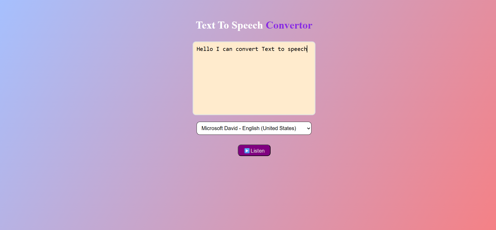

# 📣 TextVoice — Text-to-Speech Converter

A lightweight, browser-native text-to-speech app built using the Web Speech API. Type any text, choose a voice, and let your browser speak it aloud.

---

## 🖼️ App Preview



---

## 🚀 Features

- 🎤 Convert typed text to speech instantly
- 🌍 Choose from multiple system voices (language + accent)
- 🧠 Built with pure HTML, CSS, and JavaScript — no libraries
- 🎨 Responsive and styled with Flexbox and gradients
- 🔒 Works offline in modern browsers (Chrome, Edge, Firefox)

---

## 🧱 Tech Stack

- **HTML5** — semantic structure
- **CSS3** — Flexbox layout, gradient background, styled inputs
- **JavaScript** — Web Speech API (`SpeechSynthesisUtterance`, `speechSynthesis.getVoices()`)

---


1. Clone the repo:
   ```bash
   git clone https://github.com/your-username/textvoice.git
